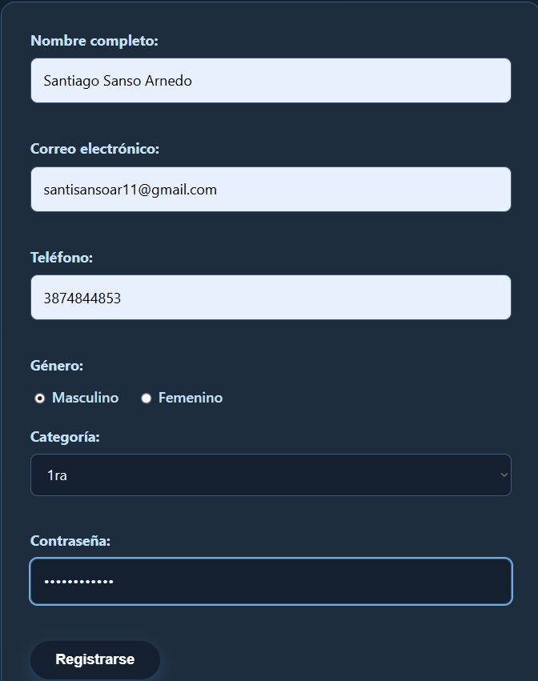
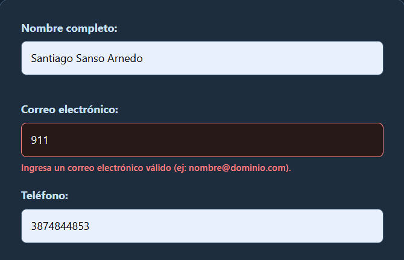
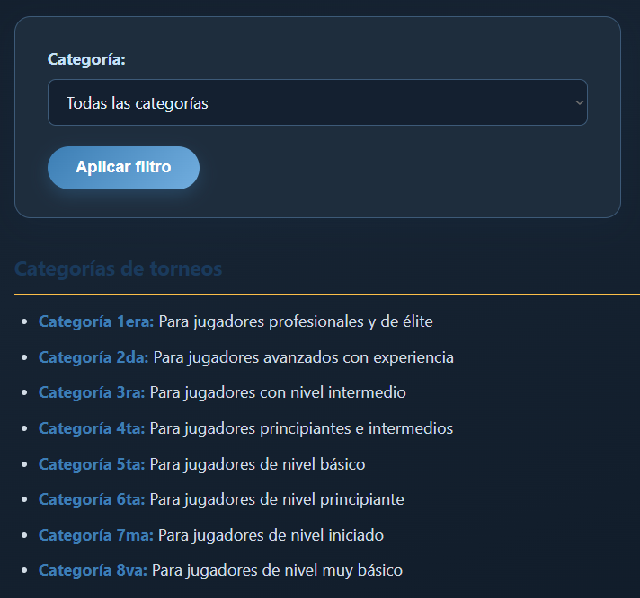

# Padel Tournament Organizer - PHP (Unidad 4)

Este proyecto corresponde a la evolución del sitio web estático hacia una aplicación dinámica basada en **PHP (Server-Side Rendering - SSR)** y **modularización mediante Server Side Includes (SSI)**.

## 🚀 Descripción de la Refactorización
- **Migración a PHP**: transformación del maquetado estático HTML a archivos PHP.
- **Modularización (SSI)**: uso de plantillas reutilizables (`header.php`, `nav.php`, `footer.php`) dentro de la carpeta `includes/` para evitar redundancia de código HTML.
- **Renderizado dinámico (SSR)**: uso de variables como `$titulo_pagina` y `$descripcion_pagina` para actualizar metadatos y la navegación.
- **Variables de entorno**: uso de `.env` y `config/env.php` para configuraciones globales de la aplicación.

## 🎨 Prototipo de Figma
- https://www.figma.com/proto/SnTRmj5HZr4oCsBZA1xkOT/Padel-Organizer?node-id=21-122&p=f&t=lBY13I9wcSZAnxFW-1&scaling=contain&content-scaling=fixed&page-id=0%3A1&starting-point-node-id=2%3A6

## 🛠️ Tecnologías utilizadas
- HTML5 y CSS3
- JavaScript ES6
- PHP 8.x
- XAMPP / Laragon
- Git y GitHub

## 🔧 Ejecución local
1. Instalar XAMPP o Laragon con PHP 8.x.
2. Colocar el proyecto dentro de `htdocs` (XAMPP) o `www` (Laragon).
3. Copiar `.env.example` como `.env` y completar los valores necesarios.
4. Iniciar Apache.
5. Abrir el proyecto desde `localhost`.

---

# Clase 5 - Procesamiento de Formularios y Seguridad Web

En esta entrega se incorporó procesamiento de formularios del lado del servidor mediante los métodos **POST** y **GET**, junto con validación, sanitización y codificación de salida para reducir el riesgo de ataques **Cross-Site Scripting (XSS)**.

## 1. Formulario POST - Contacto

Archivo: `contacto.php`

El formulario de contacto utiliza `method="post"` y permite enviar:
- Nombre.
- Correo electrónico.
- Mensaje.

El servidor procesa los datos solamente cuando `$_SERVER['REQUEST_METHOD'] === 'POST'`.

### Validaciones implementadas
- Se comprueba que nombre, correo y mensaje no estén vacíos.
- El correo se sanitiza con `FILTER_SANITIZE_EMAIL`.
- El formato del correo se valida con `FILTER_VALIDATE_EMAIL`.
- El nombre debe tener al menos 2 caracteres.
- El mensaje debe tener entre 10 y 1000 caracteres.

### Seguridad XSS
- Se usa `trim()` para eliminar espacios innecesarios.
- Se usa `strip_tags()` para remover etiquetas HTML de las entradas de texto.
- Se usa `filter_var()` para sanitizar y validar el correo.
- Antes de mostrar cualquier dato en HTML se utiliza `htmlspecialchars(..., ENT_QUOTES, 'UTF-8')`.

### Retroalimentación y persistencia
- Si el envío es correcto, se muestra un mensaje de confirmación.
- Si existe un error, se muestra una lista con los problemas encontrados.
- En caso de error, los valores ya ingresados permanecen cargados en los campos para que el usuario no tenga que escribirlos nuevamente.

## 2. Formulario GET - Filtro de torneos

Archivo: `torneos-de-padel.php`

Se agregó un formulario con `method="get"` para filtrar los torneos según la categoría seleccionada.

Ejemplo de consulta:

```text
torneos-de-padel.php?categoria=3ra
```

### Validaciones implementadas
- Se comprueba la existencia del parámetro `categoria` antes de utilizarlo.
- Se rechazan valores enviados como arreglos.
- Se sanitiza la entrada antes de procesarla.
- Se aplica una **lista blanca** de categorías permitidas (`1era` a `8va`).
- Si la categoría no existe, se informa el error al usuario.

### Seguridad XSS
Ningún valor procedente de `$_GET` se imprime directamente. Toda salida dinámica pasa por `htmlspecialchars()`.

## 3. Pruebas sugeridas

### POST válido
Completar `contacto.php` con datos correctos y verificar el mensaje de éxito.

### POST con errores
- Dejar campos vacíos.
- Escribir un correo inválido.
- Escribir un mensaje demasiado corto.

Debe aparecer el mensaje de error y conservarse la información ingresada.

### Prueba XSS en POST
Ingresar como nombre un texto que contenga etiquetas HTML o JavaScript. El navegador no debe ejecutar código.

### GET válido
Abrir, por ejemplo:

```text
torneos-de-padel.php?categoria=4ta
```

Debe mostrarse solamente la categoría seleccionada.

### GET inválido / XSS
Modificar manualmente el parámetro `categoria` en la URL con un valor no permitido. La aplicación debe rechazarlo y mostrar un mensaje de error sin ejecutar código.

## 📷 Capturas de pantalla para la entrega

Guardar las evidencias dentro de la carpeta `imagenes/` con nombres similares a estos:

1. `clase5-post-exito.png` - formulario POST enviado correctamente.
2. `clase5-post-validacion.png` - errores de validación y campos persistentes.
3. `clase5-get-filtro.png` - filtro GET funcionando y parámetro visible en la URL.
4. `clase5-xss.png` - prueba donde un valor malicioso es neutralizado o rechazado.

Luego pueden agregarse al README de esta forma:

```md


```

## 📁 Estructura de entrega

La entrega correspondiente debe ubicarse dentro de una carpeta llamada exactamente:

```text
clase5/
```

La carpeta debe contener el proyecto actualizado de esta clase junto con sus recursos (`includes`, `config`, CSS, JavaScript e imágenes) para que pueda ejecutarse de manera independiente.
## Capturas de funcionamiento

### Formulario POST procesado correctamente


### Validación del formulario POST


### Filtro mediante GET


### Protección frente a XSS

### Prueba de protección contra XSS

Se ingresó una etiqueta `<script>` en el formulario de contacto para comprobar
que el servidor sanitiza los datos recibidos. El código JavaScript no fue ejecutado
por el navegador.