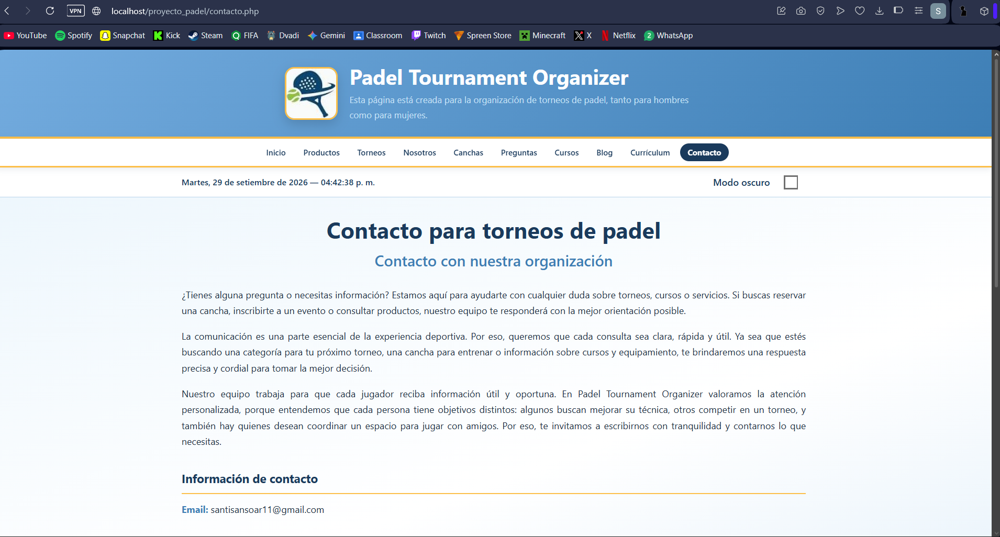
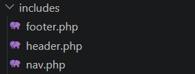
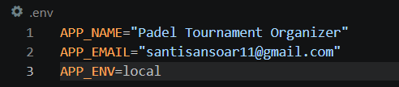
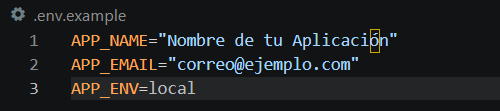

# Padel Tournament Organizer - Refactorización a PHP (Unidad 4)

Este proyecto corresponde a la evolución del sitio web estático desarrollado en el Hito 1 hacia una aplicación dinámica basada en **PHP (Server-Side Rendering - SSR)** y **Modularización mediante Server Side Includes (SSI)**.

## 🚀 Descripción de la Refactorización
- **Migración a PHP**: Transformación de maquetado estático HTML a archivos PHP.
- **Modularización (SSI)**: Creación de plantillas reutilizables (`header.php`, `nav.php`, `footer.php`) dentro de la carpeta `includes/` para evitar redundancia de código HTML.
- **Renderizado Dinámico (SSR)**: Definición de variables globales (`$titulo_pagina`, `$descripcion_pagina`) para la actualización dinámica de metadatos y marcado automático de la pestaña activa en el menú de navegación.
- **Variables de Entorno**: Implementación de archivos `.env` y parser en `config/env.php` para almacenar configuraciones globales de la aplicación (nombre del sitio, mail de soporte, entorno de ejecución).

## 🎨 Prototipo de Figma
- [Enlace al Prototipo en Figma](https://figma.com) *(reemplazar por tu enlace de Figma)*

## 🛠️ Tecnologías Utilizadas
- **HTML5 & CSS3** (Modular y Responsive)
- **JavaScript (ES6)**
- **PHP 8.x**
- **Servidor Web Local (XAMPP / Laragon)**
- **Git & GitHub**

## 🔧 Instrucciones de Instalación y Ejecución Local
1. Asegúrate de tener instalado **XAMPP** o **Laragon** con soporte para PHP 8.x.
2. Clona este repositorio o coloca la carpeta del proyecto en `C:\xampp\htdocs\padel`.
3. Copia el archivo `.env.example` y renómbralo a `.env`:
   ```bash
   cp .env.example .env
## 📷 Evidencias de Funcionamiento

### 1. Servidor Local Ejecutándose


### 2. Estructura Modular (SSI)


### 3. Navegación Dinámica y Título


### 4. Variables de Entorno

